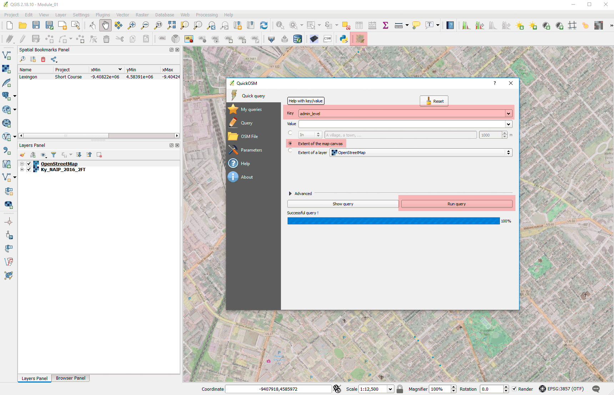

# QGIS Short Course

Welcome to a workshop on QGIS. The intended audience 

## Overview

Within this short course you will:

* Gain a basic conceptual understanding of cartography, GIS, and mapping
* Gain familiarity with geographic data and information, and how it's encoded within computer files
* Download and install a free and open-source GIS application (QGIS)
* Create and query a spatial database
* Gain a basic familiarity with the QGIS interface
* Gain awareness of spatial reference and projection issues
* Practice opening a variety of geographic data with QGIS and viewing their attributes within QGIS
* Perform basic map styling
* Create and export a basic map as a static image file

## Short course audience and convention

We also use the following written conventions:

* Tools that you click will be bolded, e.g. **Project > New** to create a new QGIS project file. 
* Text that you’ll need to type will have quotes around it, such as, “My New Project” 
* Names of files and directories will be italicized, e.g., _datapage.zip_.
* Code that needs to be written and function parameters will be either ```inline``` or in a 

```
sql
/* Block of SQL code that needs to be entered in the DB Manager */

SELECT * FROM my_table
```


## Data and project space

The following zip files contain spatial data that we'll use in this lesson.

* [Part 1: Making Lunch!](project_assets/module_part_01.zip), 11 MB
* [Part 2: Wildfire in Kentucky](project_assets/module_part_02.zip), 28 MB

Create a folder in the Z:/user/ directory called, *__FirstName__GIS*, while substituting with your appropriate name. Please download and extract the data to this folder. Let's begin!


## About QGIS

   
Figure: 01 Accessing component information about QGIS


   
Figure: QGIS project is part of [OSGeo](http://osgeo.org)

## Adding plugins and base maps

   
Figure:

   
Figure:

   
Figure:

   
Figure:


   
Figure:

### Spatial Bookmarks

   
Figure:

## Using OpenStreetMap data

   
Figure:


   
Figure:


   
Figure:

### Interrogating OSM attributes

   
Figure:

   
Figure:

   
Figure:

   
Figure:

### Rule-based symbology of OSM layers

   
Figure:

   
Figure:

   
Figure:


   
Figure:

   
Figure:


   
Figure:

### Filtering OSM attributes

   
Figure:


   
Figure:

### Publish map in Print Composer

   
Figure:


   
Figure:


   
Figure:


   
Figure:


   
Figure:

## Geoprocessing with QGIS

   
Figure:


   
Figure:

## Adding plugins and base maps

   
Figure:

   
Figure:

   
Figure:

   
Figure:


   
Figure:

### Spatial Bookmarks

   
Figure:

## Using OpenStreetMap data

   
Figure:


   
Figure:


   
Figure:

### Interrogating OSM attributes

   
Figure:

   
Figure:

   
Figure:

   
Figure:

### Rule-based symbology of OSM layers

   
Figure:

   
Figure:

   
Figure:


   
Figure:


## Course credits

