# QGIS Short Course

June 27, 2017

Table of Contents
=================

   * [QGIS Short Course](#qgis-short-course)
      * [Short course audience and convention](#short-course-audience-and-convention)
      * [Data and project space](#data-and-project-space)
      * [About QGIS](#about-qgis)
      * [Adding plugins and base maps](#adding-plugins-and-base-maps)
         * [Spatial Bookmarks](#spatial-bookmarks)
      * [Using OpenStreetMap data: Where to eat Lunch?](#using-openstreetmap-data-where-to-eat-lunch)
         * [Measuring and interrogating OSM features](#measuring-and-interrogating-osm-features)
         * [Rule-based symbology of OSM layers](#rule-based-symbology-of-osm-layers)
         * [Filtering OSM attributes](#filtering-osm-attributes)
         * [Publish map in Print Composer](#publish-map-in-print-composer)
      * [Geoprocessing with QGIS: Wildfire rates in Kentucky](#geoprocessing-with-qgis-wildfire-rates-in-kentucky)
         * [Using DB Manager and SpatiaLite spatial database to calculate rate of wildfire](#using-db-manager-and-spatialite-spatial-database-to-calculate-rate-of-wildfire)
      * [Use QGIS Vector tools for analysis](#use-qgis-vector-tools-for-analysis)
         * [Compare to intersect analysis in SpatiaLite](#compare-to-intersect-analysis-in-spatialite)
      * [Helpful references](#helpful-references)
      * [Data sources](#data-sources)
      * [Credits](#credits)


## Short course audience and convention

This short course is geared towards working GIS professionals who have a general knowledge of ESRI ArcGIS. We will focus creating
 a production workflow that uses the unique features of QGIS not found in ArcGIS. This course is not solely intended to replace ESRI products, but rather compliment them. Since QGIS and associated tools are free and open source software (FOSS), it's a handy dimension to add to any GIS shop.
 
We use the following written conventions:

* Tools that you click will be bolded, e.g. **Project > New** to create a new QGIS project file. 
* Text that you’ll need to type will have quotes around it, such as, “My New Project” 
* Names of files and directories will be italicized, e.g., _datapage.zip_.
* Code that needs to be written and function parameters will be either ```inline``` or in a 

```SQL
/* Block of SQL code that needs to be entered in the DB Manager */

SELECT 
	*
FROM 
	my_table
```
If the screenshots found in this document are too small to read, then __right+click__ the graphic and open in a new browser window.


## Data and project space in lab

The following zip files contain spatial data, project documents, and support files that we'll use in this lesson.

* [Part 1: Making Lunch!](project_assets/module_part_01.zip), 11 MB
* [Part 2: Wildfire in Kentucky](project_assets/module_part_02.zip), 28 MB

Create a folder in the Z:/user/ directory called, *FirstNameGIS*, while substituting with your appropriate name. Please download and extract the data to this folder. Let's begin!


## About QGIS

We often think of QGIS as free software and data. In fact, it is free to use for profit. More importantly, open source is as much about an ethos of contributing your tools, ideas, and data. OpenStreetMap (OSM), the wikipedia of maps, is tightly integrated with QGIS. 

QGIS functionality is supported by open source libraries. A few of which are important to note. 

* [Geospatial Data Abstraction Library named GDAL](http://www.gdal.org/). GDAL is actually two libraries: 1) GDAL is used for manipulating raster data and 2) OGR is used for manipulating vector data (see below for the distinction between these two data modules). GDAL and OGR operations are fast and powerful, and they can be used independently of QGIS either via a command line interface or other tools.
* [Geometry Engine, Open Source named GEOS](https://trac.osgeo.org/geos/) provides functionality for different geometry types and geoprocessing functions like intersect, union, etc.


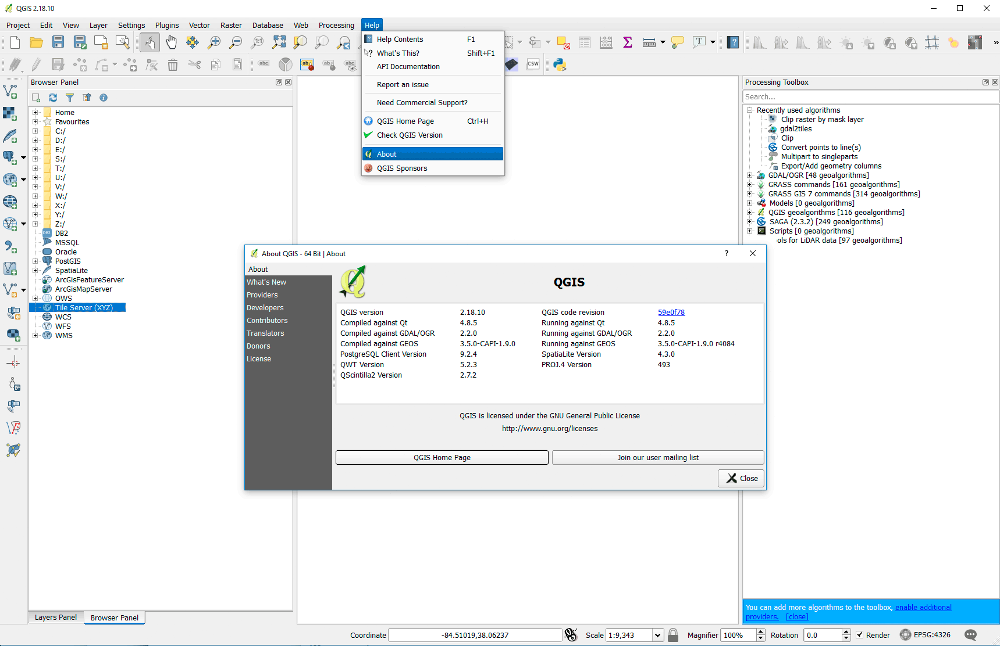   
Screenshot: Accessing component information about QGIS.


   
Screenshot: QGIS project is part of [OSGeo](http://osgeo.org).

The QGIS interface is broken down into 5 major sections:

* the **menubar**, where you'll find a number of dropdown menus from which you can access most of the program's features. 
* the **toolbar**, this is where your default toolbars and any optional ones you choose to install will live, they provide graphical access to many of the same features accessible through the menubar as well as some that are not in the menubar. Take time and hover over each tool button and see what it does.
* the **Layers Panel**, aka map legend, where you can view and manipulate the various layers within your map (users sometimes close this window accidentally and "lose" their legend, it can be reopened via the menubar by going to **View** > **Panels** and selecting **Layers** from the popup menu)
* the **Map Canvas**, where you can view your map.
* the **Browser Panel** is a directory tree, or catalog, of your accessible data.
* the **status bar**, which provides information about the coordinate location of your mouse pointer, the Coordinate Reference System (CRS) of the current map, the scale of the current map view, a rendering progress bar and notifications of the availability of plug-in updates.

There are many more panels and tools not listed here. For an item by item rundown of the QGIS user interface, consult the [QGIS User Guide](http://docs.qgis.org/2.14/en/docs/user_manual/introduction/qgis_gui.html).

## Adding plugins and base maps

What makes QGIS especially powerful within the mapping community are the wide array of plugins written by various developers. Plugins are small programs that enhance and extend the functionality natively built into QGIS. They are easily installed from within the QGIS application itself. You can peruse the [available QGIS plugins](https://plugins.qgis.org/plugins/). 

Step 01: Install OuickOSM at main menu > **Plugins > Manage and Install Plugins... > Search "QuickOSM"**.
   
Screenshot: User-contributed plugins are one of great assets of QGIS.

Step 02: Install OpenLayers at QGIS main menu > **Plugins > Manage and Install Plugins... > Search "OpenLayers"**.
   
Screenshot: OpenLayers plugin provides many raster base maps to help start a project.

Step 03: Add tile set at QGIS **Browser Panel > Tile Server (XYZ) [right+click] > New Connection..** and add the URL:
```https://tile.openstreetmap.org/{z}/{x}/{y}.png```
   
Screenshot: Tile Server (XYZ) offers fast access to the growing world of raster base map tile sets.

Other tile servers to add include the following:

```
/* Classy minimal style map */
https://stamen-tiles-{s}.a.ssl.fastly.net/toner-hybrid/{z}/{x}/{y}.png

/* ESRI world imagery for free applications */
https://server.arcgisonline.com/ArcGIS/rest/services/World_Imagery/MapServer/tile/{z}/{y}/{x}
```
Step 04: Add 2016 [NAIP imagery](https://gis.apfo.usda.gov/arcgis/rest/services/NAIP) at QGIS Add data menu > **Add WMS/WMTS Layer... > New** and add the URL:
```https://gis.apfo.usda.gov/arcgis/services/NAIP/Kentucky_2016_60cm/ImageServer/WMSServer```
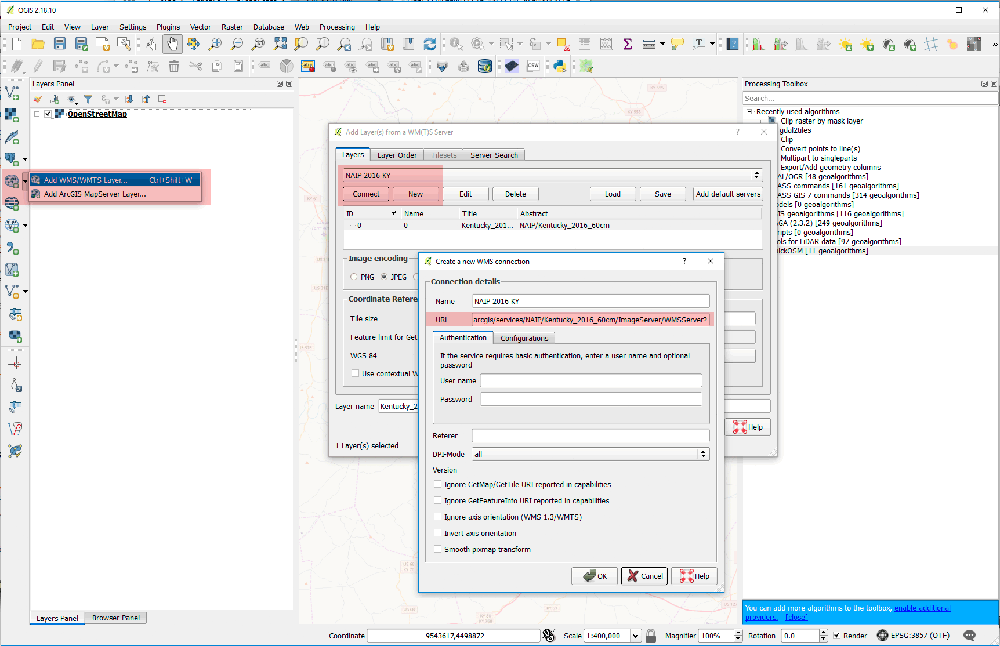   
Screenshot: Web Mapping Services (WMS) is a traditional method of adding layers to a mapping project.

Other WMS services might be faster. Check out Kentucky's [WMS services](http://kyraster.ky.gov/arcgis/rest/services):

```http://kyraster.ky.gov/arcgis/services/ImageServices/Ky_NAIP_2016_2FT/ImageServer/WMSServer ```

   
Screenshot: Layers in QGIS always have transparency options.

### Spatial Bookmarks

   
Screenshot: Use spatial bookmarks to set map canvas views.

-----

## Using OpenStreetMap data: Where to eat Lunch?

OpenStreetMap is the world's largest crowdsourced mapping project. It is a free, open-source, volunteer-generated global map that aims to be the "Wikipedia of maps" and global GIS data repository. As of February 2017 [OSM stats](http://www.openstreetmap.org/stats/data_stats.html), there were 3.5 million registered users and 5.7 billion GPS points uploaded. 

OSM has a basic data structure with a few [important elements](http://wiki.openstreetmap.org/wiki/Elements). The _node_, or coordinate point, is the basic geographic object. A node represents a specific point on the earth's surface. Each node comprises at least an id number and a pair of coordinates. Nodes can be combined into _ways_; an open way is a polyline and a closed way is a polygon. OSM data uses only WGS84 coordinates. _Relations_ group geographic objects in familiar relationships, such as routes (bus routes in a city) and multi-polygons (many closed ways belong to the same group).

OpenStreetMap uses _tags_ of the form key=value to add meaning to geographic objects. For example, we could use the following query to find all building polygons that are tagged as 'residential': ```"building" = 'residential'```. Using familiar SQL statements, we can easily filter large datasets to map precisely what we want.

Step 05: Add features from OSM using QGIS main menu > **Web > QuickOSM > Key: "Admin_level"**.
   
Screenshot: QuickOSM is one of the easiest ways to get OSM data in a mapping project.

Before you **Submit Query** change the **Parameters tab > Output** to **GeoJSON**.
   
Screenshot: GeoJSON is the preferred format on Win and Mac OS and it __is__ editable.

Step 06: Alter polygon symbology at QGIS main menu > **Layers Panel > admin_level [double+click] > Style > Fill Style > No Brush**.
   
Screenshot: Accessing the layer's Style tab to change the appearance of features.

### Measuring and interrogating OSM features

   
Screenshot: Accessing Project Properties to control project.

Step 07: Change measurement options in the QGIS main menu > **Project Properties > General tab > Measurements**.
   
Screenshot: Change measurement units in the General tab.

Step 08: Measure polygon in the QGIS main menu > **Identify tool > feature [click] > Derived**.
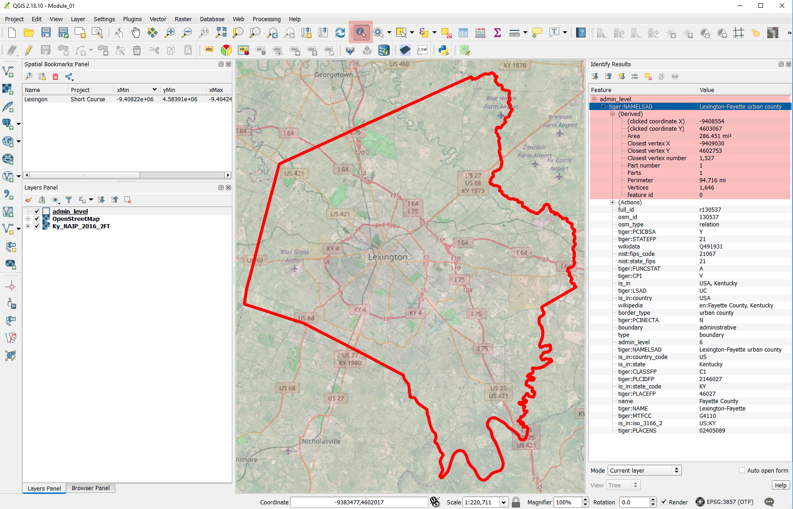   
Screenshot: Use the Identity tool to find attributes and measurements.

Step 09: Change CRS of project 'on the fly' in the QGIS main menu > **Project Properties > CRS > Filter > EPSG: 3089**. This will project our layers (temporarily) to the Kentucky single-zone CRS. Change the **Project Properties > General tab > Measurements > Ellipsoid > Planimetric**. This will ensure that we're measuring in the right CRS.

   
Screenshot: QuickOSM data adds actions to the Action Identify tool to find source information on OSM.

### Rule-based symbology of OSM layers


Step 10: Add features from OSM using QGIS main menu > **Web > QuickOSM > Key: "Highway"**.
   
Screenshot: Add highway (travel) features to your project.

OSM data is attributed the same everywhere in the world, e.g., what is *trunk* road? The levels of road symbology might not be intuitive so please look at the key:value pairs for [http://wiki.openstreetmap.org/wiki/Key:highway](http://wiki.openstreetmap.org/wiki/Key:highway). 

Step 11: Enable rule-based symbology at QGIS main menu > **Layers Panel > highway [double+click] > Style > Rule-based**.
   
Screenshot: Rule-based symbology uses SQL to select features.

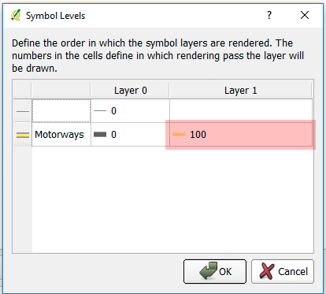   
Screenshot: Symbol levels control what features draw first (on the bottom) and last (on the top).

Step 12: Practice labeling in the **Layer Properties > Labels tab**
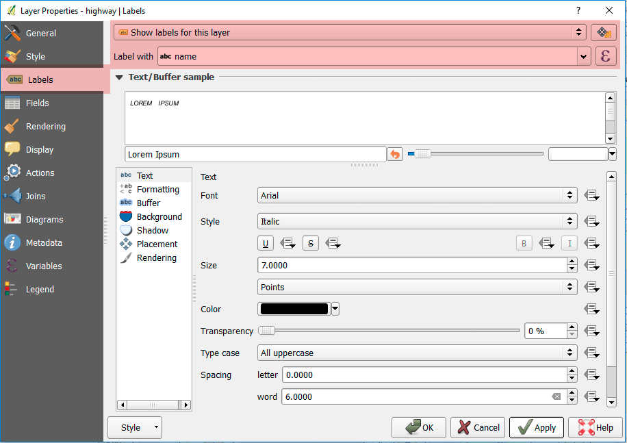   
Screenshot: Label Panel adds dynamic labels for features.

Step 13: Import layer style in the **Layer Properties > Style tab > Style > Load Style > Load from file...** and load the following file:
```osm-road-line-style.qml```
   
Screenshot: Save and share complex layers styles with the QGIS .qml file.


   
Screenshot: A simple travel map of campus.

### Filtering OSM attributes

Step 14: Add Amenity features from OSM using **Web > QuickOSM > Key: "Amenity"**.

Step 15: Show only certain amenities using **Layers Panel > amenity [right+click] > Filter...** using the following expression:
```"amenity" IN ('cafe','fast_food','pub','restaurant')```

   
Screenshot: Filter layers with SQL.


   
Screenshot: Easily use SVG artwork for point symbols.

### Publish map in Print Composer


Step 16: Create new layout using **Project > New Print Composer**
   
Screenshot: Map layouts for export or print use the QGIS Print Composer, which can contain multiple layouts.

Add various map elements with the Add Items menu bar, such as Map Canvas frame, text frame, legend, and scale.

Step 17: Publish finish map using **Composer > Export as Image...**
   
Screenshot: Automatically create georeferenced image on Export.


   
Screenshot: Add the exported map into a QGIS Map Canvas.

Finally, use the **Measure tool** to measure a walk from Whitehall to your favorite restaurant.

   
Screenshot: Measure the distance to the your preferred restaurant.

Exporting to a GeoJSON is a common workflow in open source web mapping, but just remember to use the WGS84 CRS (EPSG:4326). You can check your layer at [http://geojson.io](http://geojson.io)

   
Screenshot: Export the point layer as GeoJSON while controlling for CRS.

-----

## Geoprocessing with QGIS: Wildfire rates in Kentucky

In this part we will analyze wildfire rates in Kentucky using two different workflows:

* A tool-based workflow that is similar to ArcGIS 
* An SQL workflow that is native to QGIS

Step 01: Add a spatial database at QGIS **Browser Panel > SpatiaLite [right+click] > New Connection..** and find the following SQLite database, "wildfire-kentucky-EPSG-3089.sqlite".

Step 02: Open **Database > DB Manager**, add the *ky_wildfire* layer to the Map Canvas, and access its Style tab.
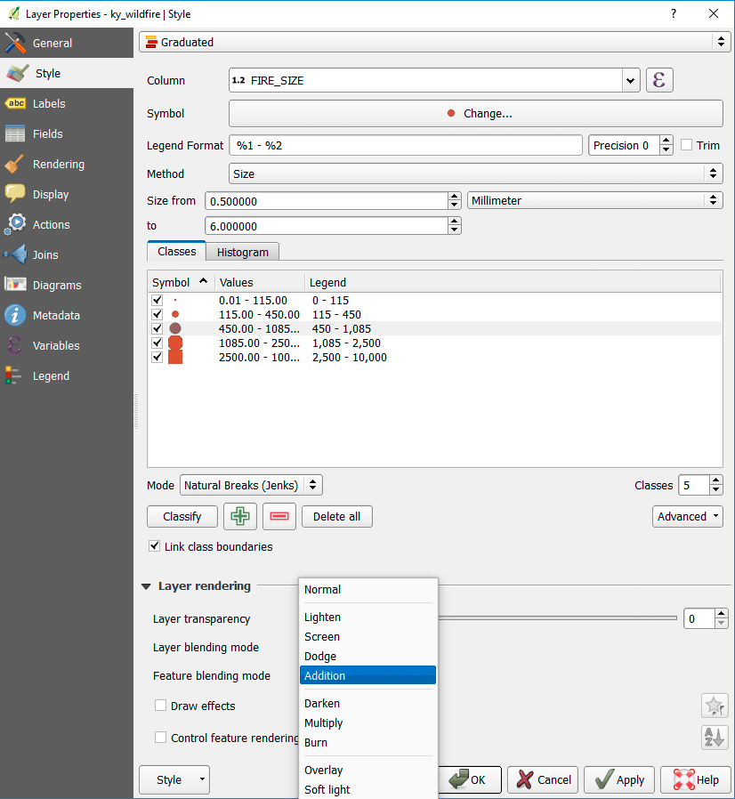   
Screenshot: Feature blending modes can create visualizations of density.

Step 03: Change the background color of the Map Canvas to a dark color using **Project > Project Properties > General tab > Background color** and use the **HTML notation value** of ```#404040```.
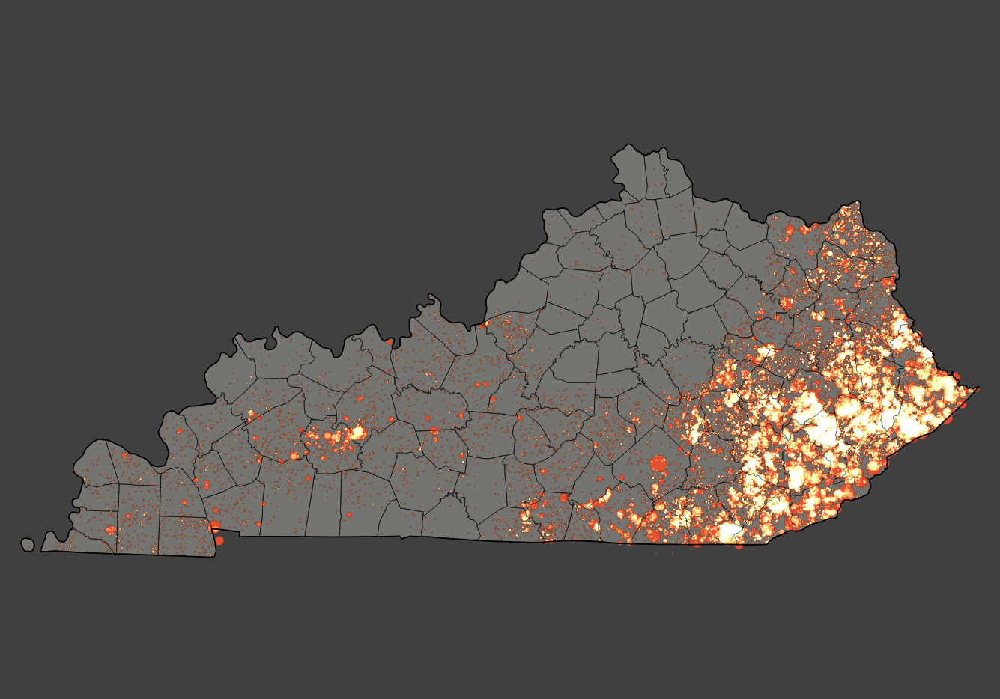   
Screenshot: Wildfire point locations

Step 04: Open **Database > DB Manager > SQL window** and execute the following statement: 

```SQL
/* Analysis of wildfire point file */

-- Copy and paste into DB Manager

select 
	sum(fire_size) as total_fire_acres,
	fips_name
from 
	ky_wildfire
group by 
	fips_name 
order by 
	total_fire_acres;
```

### Using DB Manager and SpatiaLite spatial database to calculate rate of wildfire

The SpatiaLite spatial database stores geometry in a table and provides spatial functions to analyze and process that geometry. In the open source world, we have two popular spatial databases, [PostGIS](http://www.postgis.net/) and [SpatiaLite](https://www.gaia-gis.it/fossil/libspatialite/index). Both share the [GEOS Library](https://trac.osgeo.org/geos/) (Geometry Engine, Open Source) to do spatial functions, like calculate areas of polygons and intersecting layers based on spatial proximity. They both use SQL (Structured Query Language) to access these functions and other data management operations, which can be scripted, shared, and reused as plain text files. 

While we call these spatial databases PostGIS and SpatiaLite, they are actually extensions to popular open source databases. PostGIS extends [PostgreSQL](https://www.postgresql.org/) and SpatiaLite extends [SQLite](http://www.sqlite.org/). While both databases are free and open source software, full-featured, share the same functions, and natively supported in QGIS, we have some notable differences.

* **PostGIS/PostgreSQL** is the preferred spatial database, but it is more difficult to install, server-based (requires a service to continuously run on a computer), and not as portable.
* **SpatiaLite/SQLite** is a server-less file-based format that is easily shared and doesn't require any additional software installation. 

We'll use SpatiaLite, but the SQL statements we execute can be done in both databases.

Step 05: Open **Database > DB Manager > Table > Create table** and create the following table: 
   
Screenshot: Create table in DB Manager menu with close attention to parameters.

Step 06: Use **DB Manager > SQL window** and execute the following statement: 

```SQL
/* Spatial join (aggregate) wildfire points by counties */

-- Copy and paste into DB Manager

insert into ky_wildfires_by_county 
	
	(
	name,
	population,
	cumulative_acres,
	geom 
	)

select
	ky_counties.name, 
	ky_counties.POP_ESTIMATE_2013, 
	sum(fire_size) as cumulative_acres,
	ky_counties.geom
from
	ky_counties, ky_wildfire
where
	st_intersects(ky_counties.geom,ky_wildfire.geom)
group by 
	ky_counties.name;
```
If you make a mistake with your query, just delete all attributes from the new table with the following statement:

```SQL
delete from ky_wildfires_by_county;
```
and rerun the corrected query.

Step 07: Symbolize and visualize your wildfire by county. Which is appropriate? 

   
Screenshot: Map total acres by county (not normalized).

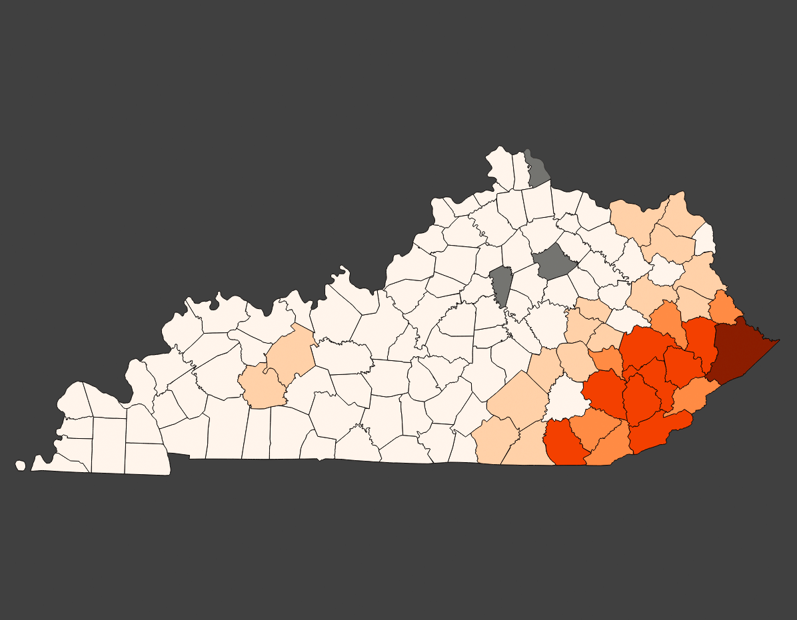   
Screenshot: Map total acres by county (not normalized).

   
Screenshot: Map cumulative acres per person by county.


   
Screenshot: Map cumulative acres per person by county.


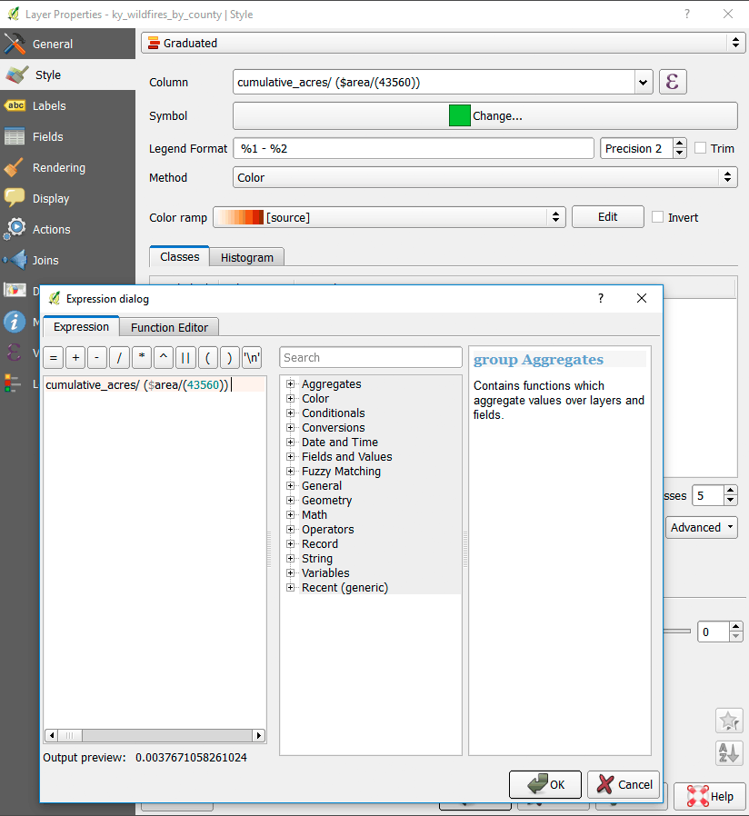   
Screenshot: Map cumulative percentage burned by county.

Use the following expression in the Style Panel to normalize by area: ```cumulative_acres/($area/43560)```.

   
Screenshot: Map cumulative percentage burned by county.

## Use QGIS Vector tools for analysis

Step 08: **Save as...** the Census block group and wildfire layers as new shapefiles with limited attributes and in the EPSG: 3089 CRS.

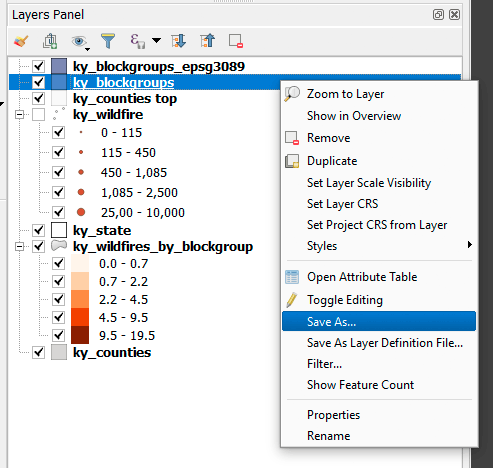   
Screenshot: Save Shapefile to a new layer.


   
Screenshot: Select attributes and CRS of new layer.


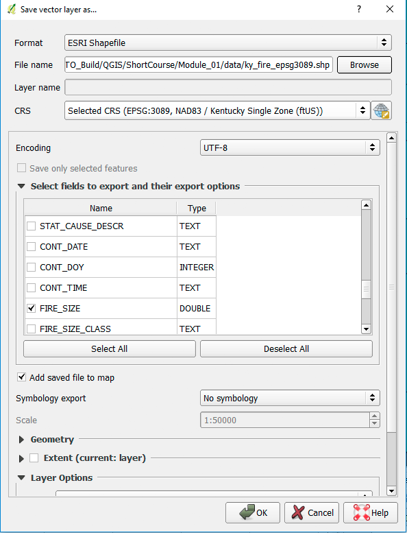   
Screenshot: Select attributes and CRS of new layer.

Step 09: Do a spatial join point in polygon analysis using the **Vector > Data Management Tools > Join attributes by location**.

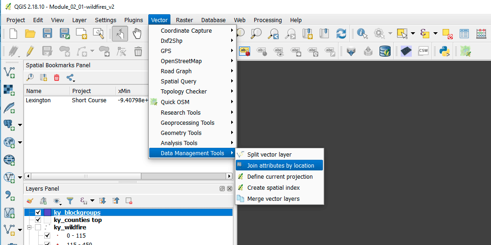   
Screenshot: Join attributes by location does a Spatial Join 

   
Screenshot: Pay close attention to tool parameters.

### Compare to intersect analysis in SpatiaLite

Step 10: Open **Database > DB Manager > Table > Create table** and create the following table: 

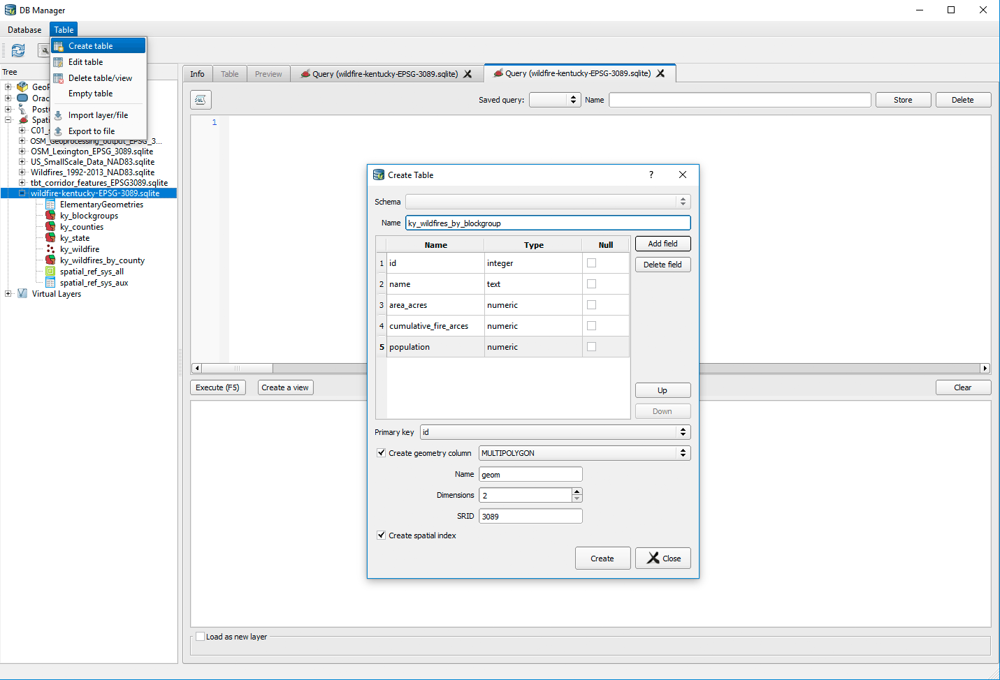   
Screenshot: Create new table in DB Manager

Step 11: Use **DB Manager > SQL window** and execute the following statement: 

```SQL

/* Spatial join with point in polygon using SpatiaLite spatial index. PostGIS automatically uses the spatial index. */

-- Copy and paste into DB Manager

insert into ky_wildfires_by_blockgroup
	(
	name,
	area_acres,
	cumulative_fire_arces,
	population,
	geom 
	)

select
	ky_blockgroups.geoid10, 
	st_area(ky_blockgroups.geom)/43560,
	sum(fire_size) as cumulative_acres,
	ky_blockgroups.b01001e1, 
	ky_blockgroups.geom
from
	ky_blockgroups, ky_wildfire
where
	st_intersects(ky_blockgroups.geom,ky_wildfire.geom)
and

/* Use the spatial index query to limit our candidate points. */
    
    ky_wildfire.rowid 

    in (

        select rowid from SpatialIndex         
        where 
            f_table_name = 'ky_wildfire'
        and
            search_frame = ky_blockgroups.geom
        )
group by ky_blockgroups.geoid10;
```

Step 12: Symbolize and publish a wildfire by block group map: 

   
Screenshot: Normalize output layer by population.


   
Screenshot: Example of choropleth map.


   
Screenshot: Publish the choropleth map in Print Composer.

## Helpful references

* [QGIS Documentation](https://www.qgis.org/en/docs/index.html)
* [A Gentle Introduction to GIS](http://docs.qgis.org/2.18/en/docs/gentle_gis_introduction/)
* [Open Source Geospatial Foundation](http://www.osgeo.org/)
* [27 Differences Between ArcGIS and QGIS – The Most Epic GIS Software Battle in GIS History](http://gisgeography.com/qgis-arcgis-differences/)
* [QGIS User guide](http://docs.qgis.org/2.18/en/docs/user_manual)
* [QGIS Training manual](http://docs.qgis.org/2.18/en/docs/training_manual/)
* [Available QGIS plugins](https://plugins.qgis.org/plugins/)
* [QGIS download page](https://www.qgis.org/en/site/forusers/download.html)
* [SQL Reference](http://www.w3schools.com/Sql/sql_quickref.asp)
* [SpatiaLite Reference](https://www.gaia-gis.it/gaia-sins/spatialite-sql-4.3.0.html)

## Data sources

* Per [OSM license and copyright requirement](https://www.openstreetmap.org/copyright) any publication use OSM data must say, “© OpenStreetMap contributors”
* Wildfire data from
	
	* Short, Karen C. 2015. Spatial wildfire occurrence data for the United States, 1992-2013 [FPA_FOD_20150323]. 3rd Edition. Fort Collins, CO: Forest Service Research Data Archive. [http://dx.doi.org/10.2737/RDS-2013-0009.3](http://dx.doi.org/10.2737/RDS-2013-0009.3)


## Credits

